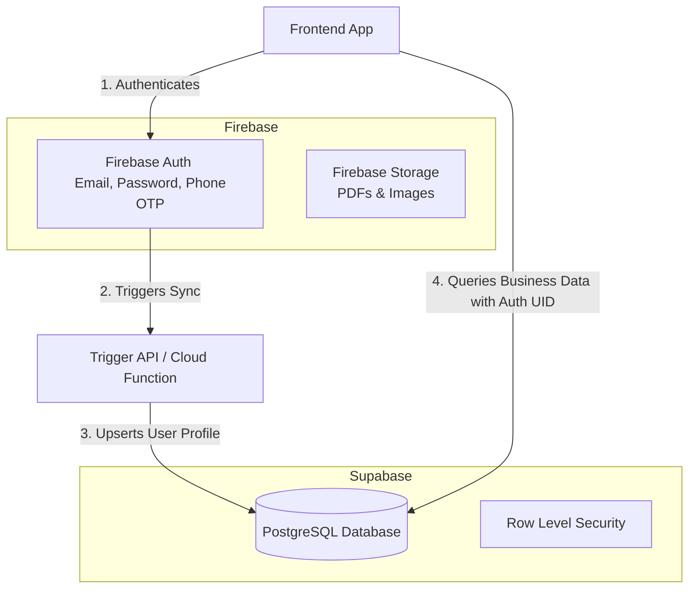

# Hybrid Backend Blueprint: Supabase + Firebase Integration

This document outlines how to safely integrate **Firebase** (for authentication, phone OTP, and messaging) with **Supabase** (for relational database storage, SQL constraints, and AI search) in a unified structure.

---

## 1. Architectural Distribution

To prevent data desynchronization, each service has dedicated responsibilities:



---

## 2. Step-by-Step Sync Integration

### Step 1: User Signs Up on Firebase
The frontend registers the user using the Firebase Client SDK:
```typescript
import { getAuth, createUserWithEmailAndPassword } from "firebase/auth";

const auth = getAuth();
const userCredential = await createUserWithEmailAndPassword(auth, email, password);
const firebaseUid = userCredential.user.uid;
```

### Step 2: Auto-Sync User to Supabase
Immediately following successful signup, call a Supabase upsert function to register the user under the exact same UID:
```typescript
import { supabase } from "@/integrations/supabase/client";

const { error } = await supabase
  .from("profiles")
  .upsert({
    id: firebaseUid, // Use Firebase UID as the primary key in Supabase
    email: email,
    full_name: fullName,
    role: selectedRole // "patient" | "doctor" | "yoga"
  });
```

### Step 3: Secure Supabase Queries
When querying user data from Supabase, filter by the active Firebase user ID:
```typescript
import { getAuth } from "firebase/auth";

const currentUid = getAuth().currentUser?.uid;

const { data: bookings } = await supabase
  .from("bookings")
  .select("*")
  .eq("patient_id", currentUid);
```

---

## 3. Best Practice Checklist
1. **Shared UID Strategy**: Never generate separate IDs. Always use the Firebase Authentication UID (`auth.currentUser.uid`) as the `id` (Primary Key) inside Supabase's `profiles` table.
2. **Handle Re-auth Gracefully**: When a user changes their password on Firebase, they remain authenticated on Supabase query layers because the profile ID doesn't change.
3. **Session Management**: Clear both sessions simultaneously upon sign-out:
   ```typescript
   await firebase.auth().signOut();
   localStorage.removeItem("supabase.auth.token");
   ```
